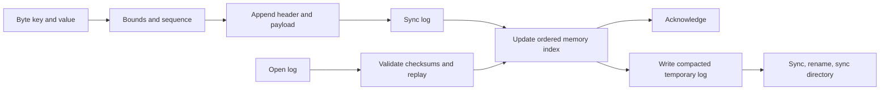

# DurableStore

**A small storage engine with a durability contract you can inspect.**

DurableStore is an original Rust byte-key store: synchronized writes, checksummed records, bounded recovery, an exclusive writer lock, and atomic compaction. Its purpose is to make storage tradeoffs measurable, from the moment a write is acknowledged to what remains after an interrupted process. It includes a usable library, JSON command-line tools, a crash demonstration, and a repeatable benchmark.

**Development history:** Built locally using Git before publication. Publication dates describe when this repository became available, not a backdated development timeline.

## Try it

Requirements: Rust 1.89 or newer, Linux or macOS, and a local filesystem. No third-party Rust dependencies, server, account, or network access at runtime.

```sh
cargo build --release --locked
mkdir demo-store
./target/release/durablestore demo-store init
./target/release/durablestore demo-store put 68656c6c6f 776f726c64
./target/release/durablestore demo-store get 68656c6c6f
# {"found":true,"value_hex":"776f726c64"} means hello -> world
./target/release/durablestore demo-store inspect
./target/release/durablestore demo-store compact
```

Keys and values use hexadecimal in the CLI, allowing arbitrary bytes. `""` represents empty bytes. `list` returns keys in byte-sorted order. `delete <key-hex>` appends a tombstone, including for absent keys. `get` exits with code **3** for a missing key; operational/input errors exit **2** with a JSON error on stderr. Successful commands emit JSON on stdout and exit **0**. Only `init` creates a database; the directory must already exist. The library supports values larger than common shell argument limits.

```rust
use durablestore::Store;

fn save_result(directory: &std::path::Path) -> durablestore::Result<()> {
    let mut store = Store::open(directory)?;
    store.put(b"experiment", b"complete")?; // sync succeeds before returning
    assert_eq!(store.get(b"experiment"), Some(b"complete".as_slice()));
    store.delete(b"experiment")?;
    store.compact()?;
    Ok(())
}
```

## Persistence, precisely

| Event | Behavior |
| --- | --- |
| `put` / `delete` returns `Ok` | Complete record was written and `File::sync_all` succeeded. |
| Process dies before acknowledgement | That operation may be absent or present. Earlier acknowledged state survives under the supported filesystem contract. |
| Incomplete terminal record | Opening discards only its incomplete bytes, synchronizes the repair, and reports the count in `Stats::tail_bytes`. |
| Full record has bad checksum, bad lengths, or wrong sequence | Opening fails without modifying `data.wal`. |
| Append or compaction fails | Further writes are rejected on that handle. Drop and reopen to determine the persisted state. Reads on the old handle remain its last acknowledged in-memory state. |
| Another handle owns the store | Open and inspection fail immediately instead of waiting indefinitely. |
| Compaction is interrupted | Recovery uses the original log or the atomically replaced compacted log. Both represent the same live state. |

`inspect` acquires the lock and scans without creating files or repairing a tail. Ordinary opens can repair a tail. All commands require exclusive access; this intentionally avoids a second concurrent-reader consistency contract. Never delete or replace `LOCK`, or rename/delete the store directory, while any handle is open.

Spawning a child that immediately executes a new program is supported. Do not fork and then use or drop an inherited `Store` in the child: its lock refers to the same operating-system object as the parent, and unlocking either copy releases that shared lock. Open a fresh store only after executing the child program.

A checksum detects accidental damage, not hostile changes. An incomplete suffix caused by a failed append is indistinguishable from some kinds of external truncation; recovery cannot reconstruct bytes that a separate program destroyed. The process-crash tests do **not** demonstrate power-loss safety on every controller or filesystem. Durability depends on the filesystem and hardware honoring synchronization. macOS `sync_all` is not a claim of hardware-cache flush via `F_FULLFSYNC`.

## Inside the engine



- **Ordered index:** a `BTreeMap` owns live keys and values. Reads are in memory; this is not an on-disk B-tree.
- **Write-ahead log:** versioned, little-endian, length-bounded records with separate header and payload CRC-32 checksums. Bounds are checked before allocating payload memory.
- **Compaction:** sorted live entries replace the log atomically. The lock file keeps a stable inode across replacement. Sequence numbers are local to a log and restart during compaction.
- **Initialization:** a synchronized temporary file is renamed into place. Existing partial or invalid file headers are rejected rather than treated as an empty store.

See [the binary format](docs/format.md) and [design decisions](docs/design.md). The entire implementation uses safe Rust and the standard library.

## Crash it, then recover

```sh
cargo test --locked
cargo test --locked --all-features
cargo build --locked --features fault-injection
python3 scripts/crash_demo.py target/debug/durablestore
```

The optional feature makes specifically named boundaries terminate with exit code 86, bypassing Rust destructors. The demonstration checks acknowledged values and deletions after each termination, then confirms the reopened store accepts another write. The default binary ignores those environment variables. **Do not enable `fault-injection` for real data.**

Tests also compare seeded operation sequences against an independent `BTreeMap` model, flip every individual byte of a fixture, cut its final record at every offset, interrupt initialization and tail recovery, reject oversized inputs, exercise lock contention across processes, and inject I/O errors that must poison a handle. These are bounded adversarial checks, not a proof of universal correctness.

## Measure it

```sh
cargo run --release --locked --example benchmark -- ./bench-store 1000 > benchmark.json
```

The destination must not already exist. The benchmark writes each 256-byte value twice with a sync per operation, reads warm in-memory keys, deletes a quarter of keys, compacts, and verifies every remaining key after reopening. JSON includes p50/p95/p99 latency, operation counts, compiler/OS/CPU details, log sizes, and compaction/reopen time. The directory is retained for inspection. Read timings measure the memory index, not disk lookup. Short microbenchmarks are sensitive to timer overhead, cache state, filesystem, and competing work; no cross-engine performance claim is made.

[Measured local run](docs/benchmark.json) and [verification record](docs/verification.md).

## Supported scope

Maximum key: **1 MiB**. Maximum value: **16 MiB**. Empty keys and values work. Startup is linear in log bytes and holds all live data in RAM; compaction needs temporary disk space for the full live set. There is no multi-key transaction, SQL, replication, encryption, TTL, concurrent reader process, background compaction, or network-filesystem support. Data directories must be trusted: this is not a hardened service that accepts arbitrary paths from hostile clients. Compaction removes historical versions, so preserve an offline copy if you need a forensic history.

This is a research and engineering portfolio project with explicit recovery tests, not a production database certification. MIT licensed; copyright nazeeh111.
